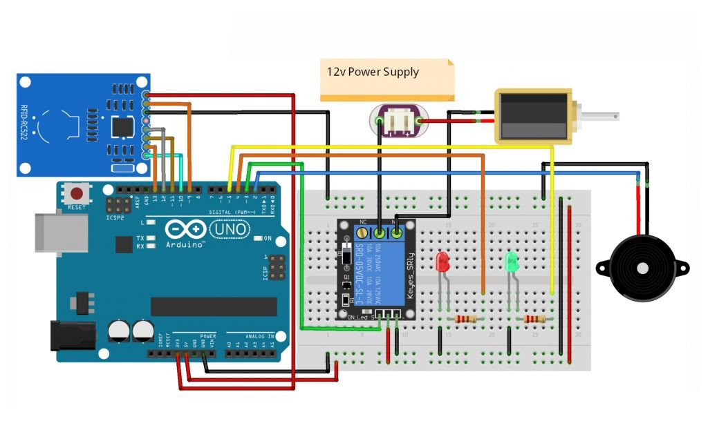

# Door Lock with RFiD

## Description:

- RFID RC522 (Radio Frequency Identification) is a technology that utilizes radio frequency as an identification of an object. RFID has 2 main component parts, namely RFID Tag and RFID Reader. RFID Tag is a device that will be identified by RFID reader which can be a passive or active device that contains data or information while RFID Reader Functions to read data from RFID Tag. Reading RFID Tag data when connected to a microcontroller can be used as a security mechanism.

## Component (Tools & Materials):

- Arduino Uno = 1 unit;
- Breadboard = 1 unit;
- Sensor RFID + key tag = 1 unit;
- Relay 5V = 1 unit;
- Buzzer = 1 unit;
- LED = 2 unit;
- Resistor 220Ω = 2 unit;
- Solenoid 12V = 1 unit;
- Power Supply 12V DC = 1 unit.

## Circuit Skematic:

    

## Wiring PinOut on Arduino:

- Pin 2 – Pin +Buzzer
- Pin 3 – Pin Signal Relay
- Pin 4 – LED Merah
- Pin 5 – LED Hijau
- Pin 9 – Pin RST RFID Reader
- Pin 10 – Pin SDA RFID Reader
- Pin 11 – Pin MOSI RFID Reader
- Pin 12 – Pin MISO RFID Reader
- Pin 13 – Pin SCK RFID Reader

## Sketch Code Program:

```cpp
#include <SPI.h>
#include <MFRC522.h>

#define SS_PIN 10
#define RST_PIN 9
#define LED_G 5
#define LED_R 4
#define RELAY 3
#define BUZZER 2
#define ACCESS_DELAY 2000
#define DENIED_DELAY 1000
MFRC522 mfrc522(SS_PIN, RST_PIN);

void setup(){
    Serial.begin(9600);
    SPI.begin();
    mfrc522.PCD_Init();
    pinMode(LED_G, OUTPUT);
    pinMode(LED_R, OUTPUT);
    pinMode(RELAY, OUTPUT);
    pinMode(BUZZER, OUTPUT);
    noTone(BUZZER);
    digitalWrite(RELAY, LOW);
    Serial.println("Letakkan kartu anda ke pembaca...");
    Serial.println();
}

void loop(){
    if ( ! mfrc522.PICC_IsNewCardPresent())   {
        return;
    }
    if ( ! mfrc522.PICC_ReadCardSerial())   {
        return;
    }
    Serial.print("UID tag :");
    String content = "";
    byte letter;
    for (byte i = 0; i < mfrc522.uid.size; i++)
    {
        Serial.print(mfrc522.uid.uidByte[i] < 0x10 ? " 0" : " ");
        Serial.print(mfrc522.uid.uidByte[i], HEX);
        content.concat(String(mfrc522.uid.uidByte[i] < 0x10 ? " 0" : " "));
        content.concat(String(mfrc522.uid.uidByte[i], HEX));
    }
    Serial.println();
    Serial.print("Message : ");
    content.toUpperCase();
    if (content.substring(1) == "83 23 38 BB")
    {
        Serial.println("Authorized access");
        Serial.println();
        delay(500);
        digitalWrite(RELAY, HIGH);
        digitalWrite(LED_G, HIGH);
        delay(ACCESS_DELAY);
        digitalWrite(RELAY, LOW);
        digitalWrite(LED_G, LOW);
    }

    else   {
        Serial.println(" Access denied");
        digitalWrite(LED_R, HIGH);
        tone(BUZZER, 300);
        delay(DENIED_DELAY);
        digitalWrite(LED_R, LOW);
        noTone(BUZZER);
    }
}
```

## Conclusion:

- In this project RFID will function as a locking mechanism. If the wrong tag is used to read the RFID, the buzzer will sound and the red LED will light up. If the correct tag is used, the solenoid will open the lock and the green LED will light up.
